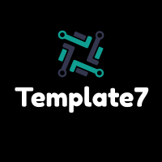

<p>
  
</p>

# Template7-Deployment

[](https://github.com/tterb/atomic-design-ui/blob/master/LICENSEs)

Template of helm deployment.

<br/>

## Deployment

### Backend

```
$ helm install backend -f ./backend/values/local.yaml ./backend
```
